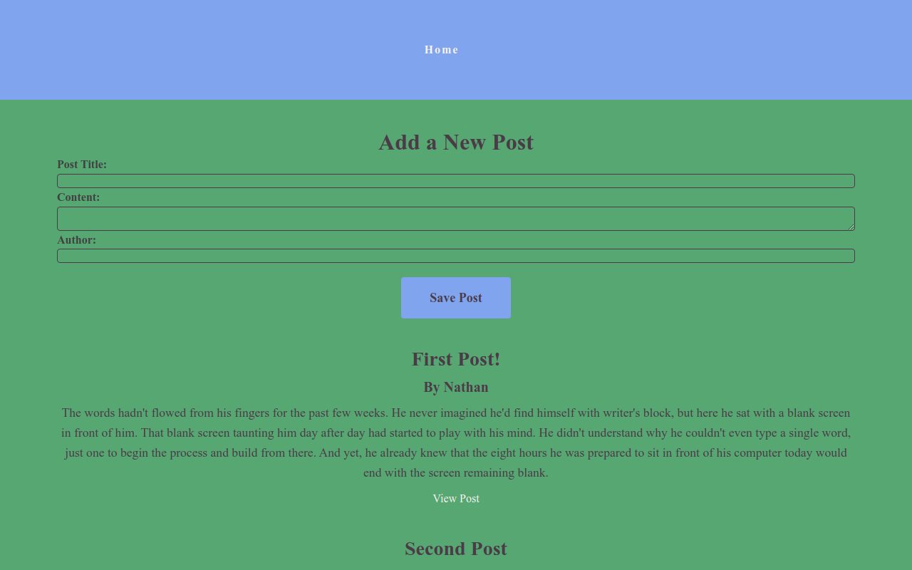

# Redux Blogging Web Application

This application was completed by Raul Uriostegui Jr on 9-29-2022.
This is the repository that holds my code. 

# Learning outcomes
I learned how to use Redux with React.js. More specifically using slices to manage actions for the posts. In addition use the react-redux hooks to call the slices actions and retrieve the corresponding state values. Lastly, link the slices to a redux store for the whole web application.

# Challenges
This project posted a few challenges as the Redux Essentials tutorial I was following had certain things outdated more so on the React Router side of things. I was able to fix them since I have learned the new version of React-Router so I was able to import the right utilities from react-router-dom. In addition I had to really take notes on the side to understand Redux since I know this is an important concept and powerful tool for modern web applications.